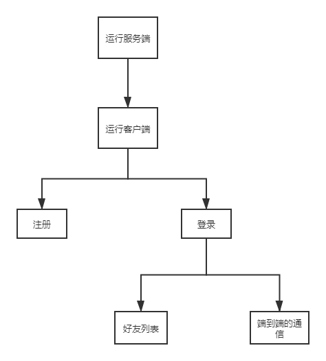

# MFC-QQ
采用MFC实现简单QQ

| 网络编程课程设计报告 二О二О年 一月 十四日 |
| ----------------------------------------- |
|                                           |
|                                           |

**课程设计的目的及要求**

主要目的是巩固网络编程技术基本知识，加深对相关概念和原理的理解，提高综合应用所学知识开发较为实用的网络应用程序的能力。通过一个较为综合的网络应用程序的开发训练，加深学生对网络通信程序开发的基本方法、基本技术和基本概念以及相关原理的理解，同时进一步提高学生编写较为复杂应用程序的能力，为学生将来从事实际应用开发打下坚实的理论和实践基础。

要求第17周一周时间内集中在网络中心的指定机房内完成，逾期实在不能完成的可延期一周利用业余时间完成。结束后在规定时间前需提交：

1、课程设计报告。

2、所开发程序的源代码，要求程序能编译运行，且功能符合基本要求。

**课程设计内容**

利用所学的网络编程技术，独立完成一个较为复杂的实用型的网络应用程序的设计开发。可从以下各题中选择一个完成：

1、编写一个图形界面的网络嗅探软件，界面模仿WireShark，协议分析层次包括网络层、传输层、应用层（能识别出DNS、FTP和WEB等几种常见应用则可）。

2、模仿QQ完成一套即时通信软件。要求：①包含一个客户软件和一个服务器软件；服务器软件负责客户的注册、登陆、在线客户管理等；客户软件包含注册、登录、根据服务器返回的在线客户信息与在线的其他客户进行聊天等功能；②客户软件工作在P2P模式，所有客户均试运行同一个软件的不同副本，两个客户软件的聊天信息是直接发送给对方的，不能经由服务器转发；③客户软件和服务器软件均采用图形界面。

3、自选题目，满足：基于WinSock编程、功能实用且程序较为复杂。

课程设计题目的选择
==================

根据题目的要求以及实习时间，结合了三个人的个人能力，决定各取所需，发挥个人的优势，我们选择了比较有挑战性的题目：模仿
QQ 完成一套即时通信软件作为我们本次课设的目标。

需求分析
========

2.1设计的背景
-------------

计算机网络技术发展至今已经大大超越了人们当初的预想，无论是人们日常的工作还是学习，我们都越来越多的依靠到互联网。各种实时性的聊天娱乐软件也同时诞生，而且为我们的即时通讯带来了众多的方便，比如说大家所熟知的腾讯QQ、微软的MSN、移动的Fetion等，都是做的比较成功的实时聊天工具。随着网络的日益普及，各种聊天工具也层出不穷，但当我们学习了《windows网络编程》这门课程之后，我们便会觉得，其实要实现简单的网络通讯其实并不难。接下来的课程设计就是针对一个简单的网络聊天程序，利用MFC为开发工具，实现基本的通讯功能。

2.2设计的原理
-------------

此程序主要分为两部分：服务器端和客户端。服务器端用于提供一个网络端口，等待客户端发出请求，登录到此服务端，然后进行网络通讯和消息的转发；客户端可通过服务器端的IP地址发送连接请求，然后登陆聊天室。在服务器端的成员列表栏中会显示在线的所有人名单，有人退出聊天室，成员列表会自动除名。服务器端同时也提供了成员之间的私聊功能，此时服务器端作为一个转发站，进行消息的转发。

2.3设计思路
-----------

服务端利用TCP保持服务器连接，UDP模拟QQ的P2P通信，

一些开始时候的准备工作：

我们用的是select模型中FD_sock管理这些套接字

我们的用户信息是在一个user.txt中存储的，所以一开始需要导入进来

之后我们就又设计的客户端，进行登陆、注册、聊天等功能。

2.4设计的功能要求
-----------------

客户端：

>   QQ登陆页面主要包含：登陆账号、登陆密码、注册、设置

>   注册页面：注册的账号、密码（账号不允许重复）

服务端：

>   用TCP保持服务器连接，UDP模拟QQ的P2P通信

2.5运行环境
-----------

本系统运正常行的硬件环境需求如下：

标准Windows10 系统PC一台;

软件支持：Visual Studio 2017

概要设计
========

3.1系统结构
-----------

1.  服务端

>   通过套接字、TCP、UDP等，完成的字符界面的服务器，连接服务器端与客户端。

1.  客户端

>   基于MFC窗口的客户端，具有登录、注册、聊天等功能。

3.2程序流程图
-------------

4详细设计与实现
===============

4.1TCP作用
----------

TCP是用来在服务器和客户端之间通信的

链接会保持，客户端的登陆退出，注册和请求另一个人的IP都是通过TCP套接字

4.2UDP的作用
------------

UDP是用来模拟实现P2P客户端与客户端之间通讯的，中间服务器起任何作用。

4.3传递的消息类型
-----------------

### 4.3.1客户端与服务器之间传递的消息

struct UserInfo

{

int op;

char name[maxn], pwd[maxn];

char ip[maxn];

char online[50][maxn];

char remsg[maxn];

int listlen;

void getonline()

{

memset(online, '\\0', sizeof(online));

for (int i = 0; i \< userip.size(); i++)

{

strcpy(online[i], onlinelist[i]);

}

}

};

#### 4.3.1.1Op 

Op的作用是区分当前的消息是什么类型的消息或者是这个消息要传递到什么地方的

#### 4.3.1.2Name pwd

登陆或者是注册时候的账号和密码信息

#### 4.3.1.3Ip

客户端请求其他客户端ip地址时 返回的ip

#### 4.3.1.4Onlinelist listlen

在线用户的列表 和 在线用户的数量

#### 4.3.1.5Remsg

结构体携带的消息

#### 4.3.1.6Void getonline（）

在服务器端获取在线的用户

### 4.3.2客户端与客户端之间传递的消息

struct ChatMsg

{

int op;

short port;

char username[100];

char msg[1000];

};

#### ①Op

当前消息的作用（后续会提到）

#### ②Port

对方的端口号

#### ③Username msg

自己的用户名和自己要发给对方的消息

4.4注册消息模块
---------------

### 4.4.1注册消息模块

#### ①Ip地址问题

当我们在登陆页面上写好了IP地址时候，那么这个IP地址会传递到注册页面上面，

#### ②注册时候

发送一个op为2的消息到服务器端，服务器端会根据当前保存的用户列表中是否存在相同的用户名来确定是否返回的消息
‘注册成功’ or ‘注册失败’.

消息发送给服务器端的监听套接字

### 4.4.2登陆模块

#### 4.4.2.1IP地址和端口号

Ip地址需要自己填写服务器的IP地址，因为我们每次登陆校园网或者是其他局域网络时都会改变

端口号是不需要填写的，因为我们已经制定好了

#### 4.4.2.2发送登陆和返回的消息

###### ①发送登陆消息时候 op=1

服务器端会判断是不是密码正确返回登陆成功or失败

###### ②服务器端返回的消息op=1

如果登陆成功会打开我们的list主列表模块并将与服务器端保持通讯的套接字传递过去

关键代码如下：if (userop == 1) //当前是登陆信息

{

string name = userinfo.name, pwd = userinfo.pwd;

UserInfo reinfo;

strcpy(reinfo.name , userinfo.name);

reinfo.op = 1;

memset(reinfo.remsg, 0, sizeof(reinfo.remsg));

if (userlog[name] == pwd)

{

char yes[10] = "yes";

cout \<\< "用户：" \<\< name \<\< " 登陆成功！" \<\< endl;

strcpy(reinfo.remsg, yes);

cout \<\< "回复消息："\<\<reinfo.remsg \<\< endl;

userip[name] = inet_ntoa(client_addr.sin_addr);

/\*\*\*\*\*\*\*\*\*\*\*\*\*\*\*\*\*\*\*\*\*\*\*\*\*\*\*\*\*\*\*\*\*\*\*\*\*\*\*\*\*\*\*\*\*\*\*\*\*\*\*\*\*/

struct sockaddr_in sa;

if (!getpeername(newsock, (struct sockaddr \*)&sa, &len))

{

printf("对方IP：%s ", inet_ntoa(sa.sin_addr));

printf("对方PORT：%d ", ntohs(sa.sin_port));

}

/\*\*\*\*\*\*\*\*\*\*\*\*\*\*\*\*\*\*\*\*\*\*\*\*\*\*\*\*\*\*\*\*\*\*\*\*\*\*\*\*\*\*\*\*\*\*\*\*\*\*\*\*\*\*/

onlineupdate();

showuserlist();

reinfo.getonline();

// \*\*\*\*\*\*\*\*\*\*\*\*\*\*\*\*\*\*\*\*\*\*\*\*\*\*\*发送登陆成功信息

if ((size = send(newsock, (char \*)&reinfo, sizeof(reinfo), 0)) \< 0)

cout \<\< "发送信息失败！错误代码:" \<\< WSAGetLastError() \<\< endl;

else if (size == 0)

cout \<\< "对方已关闭连接！\\n";

//\*\*\*\*\*\*\*\*\*\*\*\*\*\*\*\*\*\*\*\*\*\*\*\*\*\*\*\*\*\*\*\*\*\*\*\*\*\*\*\*\*\*

cout \<\< "fd size:" \<\< fdsock.fd_count \<\< endl;

reinfo.op = 4;//回复消息;

for (int j = 0; j \< fdsock.fd_count; j++)

{

if (fdsock.fd_array[j] != sock_server && j != i)

send(fdsock.fd_array[j], (char \*)&reinfo, sizeof(reinfo), 0);

}

FD_SET(newsock, \&fdsock);

}

else

{

strcpy(reinfo.remsg, "no");

if ((size = send(newsock, (char \*)&reinfo, sizeof(reinfo), 0)) \< 0)

cout \<\< "发送信息失败！错误代码:" \<\< WSAGetLastError() \<\< endl;

else if (size == 0)

cout \<\< "对方已关闭连接！\\n";

closesocket(newsock);

}

}

4.5List主列表模块
-----------------

这个模块中有我们的在线用户的列表

关键代码：

void onlineupdate()

{

int i = 0;

iter = userip.begin();

len = 0;

while (iter != userip.end()) {

if (iter-\>second == "")

{

iter++;

continue;

}

len++;

strcpy(onlinelist[i],zhuan(iter-\>first.data()));

cout \<\< "用户名：" \<\< iter-\>first \<\<" IP地址："\<\<iter-\>second\<\<
endl;

iter++;

i++;

}

cout \<\< "在线用户列表更新完成！" \<\< endl;

}

**①开启list时**

当我们登陆成功时，我们会打开list模块

这时，在一开始的oninit函数中会创建 用于监听有客户端想与我通信的消息

还会一开始导入一个onlinelist在线用户的列表（后续会更新）

**②List的维护**

主要是维护在线的列表。

有这样几个维护的时机 用户登陆，用户退出

**③用户登陆**

如果有某个用户登陆的时候
服务器发送一个op=4的消息给我们的TCP套接字，用来刷新在线的用户。

**④用户退出**

点击退出按钮的时候会先发送一个op=3的消息给服务器端，

这时候服务器端维护在线用户列表

当某个客户端的发送的消息size=0的时候说明链接已经断开，那么这时候我么广播一下这个用户列表

在FD_sock中删除

4.6在线用户列表的操作
---------------------

**①双击某个用户**

当我们双击某个用户的时候这时候就会执行双击事件，执行的代码是我们想服务器端发送一个op=4的消息用于请求用户名对应的IP地址

先创建一个chat模块用户和对面通信，在打开的时候我们会申请一个端口号用于创建一个回话UDP套接字与对面通讯

然后发送一个消息给我们请求到的IP地址，这时候UDP套接字起到作用，其中一开始的用于监听的UDP套接字的端口号是固定的

**②List中的UDP套接字的作用**

当我们收到一个消息的时候，首先我们可以确定这个消息是有人想和我们通讯，

这时候我们打开一个chat模块，用于和用户通讯，chat模块可以多次打开

当我们打开一个chat模块的时候，会创建一个UDP套接字，对应的端口号会放在一个vector中，用一个find函数来找到我们还没有用过的端口号，

准备好了自身的端口号之后立刻向对方发送一个op=0的消息，

此时对方也就指的是他给我发送消息的端口号和IP地址

告诉对面我的端口号是XXX 之后我们就可以自由的通信了

4.7Chat模块
-----------

此时我们基本上已经把所有的p2p的准备工作做完，直接开始通信即可

4.8服务器端
-----------

### ①一些开始时候的准备工作

我们用的是select模型中FD_sock管理这些套接字

我们的用户信息是在一个user.txt中存储的，所以一开始需要导入进来

当我们导入完成的时候，就可以开始创建监听套接字并开始我们的工作了

关键代码如下：

void jieshu()

{

char name[maxn], pwd[maxn];

ofstream writeFile("D://user.txt");

iter = userlog.begin();

while (iter != userlog.end()) {

//cout \<\< iter-\>first \<\< " : " \<\< iter-\>second \<\< endl;

strcpy(name ,zhuan(iter-\>first)), strcpy(pwd ,zhuan(iter-\>second));

writeFile \<\< name \<\< " " \<\< pwd \<\< endl;

iter++;

}

cout \<\< "用户数据保存成功！" \<\< endl;

}

void init()

{

ifstream readFile("D://user.txt");

char temp[1024] = { 0 };

char name[maxn], pwd[maxn];

//char a[10000], b[10000];

while (readFile \>\>name \>\> pwd)

{

userlog[name] = pwd;

cout \<\< name \<\< " " \<\< pwd \<\< endl;

}

cout \<\< "用户数据导入成功！" \<\< endl;

}

### ②op =1 接收登陆信息

接受到登陆信息的时候我们判断user列表里面的用户名和密码是不是对得上

如果可以就发送一个yes的op=1的消息回去告诉客户端

并添加这个用户到onlinelist中

并转发op=4的消息广播到其他用户让他们更新在线列表

此时套接字发送完毕套接字保存在FD_sock 中

### ③op =2 接收注册信息

判断是不是用户名重复不重复就是注册成功

更新user列表，并调用写会user.txt函数保存下来

返回一个op=2的消息，告诉客户端是不是注册成功

此时套接字发送完毕直接断开连接

### ④op =3 接收注销信息

此时我们在onlinelist中去除掉携带的username 套接字不会在现在断开

### ⑤op =4 接收用户请求ip信息

返回一个op=5的消息告诉他请求的那个用户的IP地址

### ⑥接收到size\<=0的消息

说明有用户退出了，这时候我们的在线用户列表在上次通讯的时候挤一挤创新完成，

这时候我们只需要先广播一个op=4的消息，并吧当前套接字在FD_sock中去除就可以了

5.系统整体说明书
================

5.1登陆界面
-----------

我们仿照了QQ的登陆页面，有隐藏设置的选项，隐藏设置的端口号以及服务器端IP。

这里我们采用的默认IP地址127.0.0.1以及默认的端口号。

服务器端：

5.2注册界面
-----------

服务器端：

5.3好友列表界面
---------------

可以显示用户名以及在线好友列表，最小化、退出的功能。每个用户登陆时，都会更新好友列表。

服务器端：

5.4聊天界面
-----------

两个在线好友之间可以实现端到端的通信。

服务器端：

6.总结
======

6.1遇到的问题及不足
-------------------

### 6.1.1遇到的问题

①问题：登陆的时候，在自己的电脑登陆成功，将代码完全拷贝到别人的电脑上，但登陆不成功，但在服务器端显示均为登陆成功？

问题分析与解决：在调试代码的时候，调用MessageBox()函数的时候在功能函数代码顶部加上莫名的登陆成功，后来，经指导教师指导，得知可能客户端还没来得及接受的服务器发来的消息，就执行if判断，导致客户端登陆不成功，调用Sleep()函数完美解决。

②问题：实现端对端的通信的时候，一开始图省事，想就用一个套接字解决端的端通信，即使用朋友列表对话框的套接字接受到消息，然后根据消息的用户名来放到相应的聊天对话框当中，不符实际（效率低下）且实现困难。

解决：实现苦难的原因，domodel（）函数不了解，使用过后会注销这个窗口，所有有消息来得到时候，我们调用ListBox函数控件的addString（）函数是不起作用的。我们改用CreatWindow()函数，但不知道为什么某名的出现闪现，于是，我们推翻了思路，重现采用一个聊天窗口一个套接字的思想，实现了可以多个窗口同时聊天的通信功能。

③问题：控件中的内容不能及时显示？

解决：及时调用UpdateData(TRUE)和UpdateData(FALSE)

### 6.1.2不足

①因时间原因，我们只实现了部分的功能，还有很多可以尝试的功能未实现，例如：头像、聊天时的文件传输、发送表情或者图片，登陆时的记住密码、忘记密码以及自动登录的功能。

②界面设计较为仓促，没能较为精致的设计界面，服务器端也直接采用了字符型界面，未完成、采用MFC界面设计。

③因异步消息或者越界原因，本项目存在着一个问题，但是因为时间以及技术问题，还未能解决。在多个处理中，经常会弹出此页面。

④当出现问题时，比如注册失败出现异常，程序会陷入漫长的没有反应的状况。没有加异常处理。

⑤成员列表在非正常退出时，服务器端得不到及时而有效地更新；

⑥用户登录前必须先知道服务器端的IP，这样操作显然比较麻烦；

⑦聊天记录和好友列表的缓存机制待实现

⑧只采用了较简单的select()模型（服务器端）和异步套接字模型（客户端），在实际运用中存在效率问题。

6.2个人总结
-----------

本次课程设计选了一个相对自己来说较难的，从霖开始一步步实现，确实有点费劲，有许多是自己考虑不到，比如，上面的不足的③和那个sleep()函数的添加，当时是卡了自己很久的错误。做这个的同时也体会到他是很有意思的，平常经常使用的QQ是有很多很多道道的，我们的项目比较简单只采用了较简单的select()模型（服务器端）和异步套接字模型（客户端），在实际运用中有这么多客户连接，同时发送和接受，腾讯是如何做到的效率很高的。还有就是其中的缓存机制，QQ好友列表的缓存机制是如何做到本体和服务器同步，尤其对消息对的缓存机制，QQ的服务器看来还是很强大的。本次实现的最大的困难就是实现多个对话窗口的聊天，端口如何高效的分配，这个应该和算法相关，我初步设想的是给定一个特定区间[l,r]的数，然后模拟并查集+字典就可实现删除和查找第一个可用的数即可，但这个算法的问题是不利于回收。还用明白了为啥要三次握手。总之，一步步实现对自己的收获还是很大的，以后需要多做项目，才能深刻的理解知识点和编程技巧，有机会还需要继续完善这个项目。

7.附录
======

7.1ping程序原理
---------------

ping是通过ICMP协议实现的。Ping程序发送ICMP回送请求消息给目的主机，ICMP协议规定，目的主机必须返回ICMP回送应答消息给源主机。如果源主机在一定时间内收到应答，则认为主机可达。PING利用ICMP协议包来侦测另一个主机是否可达。原理是构造并发送多个类型码为8的ICMP回送请求包，其中用发送时的时间来填写时间戳字段，使用原始套接字发送给目的机器，收到ICMP回送请求包的目的主机则将收到的ICMP包用类型码改为0，重新计算校验和并替换后再封装到IP分组中发送回去作为回应。ping程序接收目的机器会送回来的ICMP回送响应包，并以此计算发送和接收之间的时间间隔，同时统计有多少个包被送达。用户依此就可以判断网络大致的情况。利用原始套接字编程可实现ping的功能，实现时需要定义好IP数据报、ICMP包等相关的数据结构。

7.2ping程序设计大体流程
-----------------------

(1)从传给main函数的参数中读取目的地址

(2)设置套接字接收超时时间

(3)构造ICMP包

(4)计算校验和

(5)解析ICMP包

7.3代码示例
-----------

// Ping.cpp : 定义控制台应用程序的入口点。

//

\#include \<iostream\>

\#include \<winsock2.h\>

\#pragma comment(lib, "WS2_32")

\#define DATALEN 1012

\#define PACKAGENUM 10 //发送ICMP会从请求报文的个数

using namespace std;

/\*\*\*定义ICMP包结构\*\*\*/

typedef struct icmp_hdr

{

unsigned char icmp_type; // ICMP包类型

unsigned char icmp_code; // 代码

unsigned short icmp_checksum; // 校验和

unsigned short icmp_id; // 惟一确定此请求的标识，通常设置为进程ID

unsigned short icmp_sequence; // 序列号

unsigned long icmp_timestamp; // 时间戳

} IcmpHeader;

unsigned short checksum(unsigned short\* buff, int size); //校验和计算函数的声明

int main(int argc, char \*argv[])

{

/\*\*\*加载Winsock2.2\*\*\*/

WSADATA wsaData;

int ret;

if ((ret = WSAStartup(MAKEWORD(1, 0), &wsaData)) != 0)

{

cout \<\< "初始化WinSock2.2出错!";

exit(0);

}

char szDestIp[256] = { 0 };//存放要Ping的IP地址或域名

//检查ping命令的使用格式是否正确，程序调试时可用后面的代码替换

/\*if (argc \< 2)

{

cout\<\<"\\n用法: ping IP地址\|域名\\n";

return -1;

}

strcpy(szDestIp,argv[1]);\*/

/\*\*\*输入对方IP地址，调试程序时使用\*\*\*/

cout \<\< "请输入你要Ping的IP地址...\\n";

cin.getline(szDestIp, sizeof(szDestIp));

/\*\*\*将点分十进制IP地址转换为32位二进制表示的IP地址\*\*\*/

unsigned long ulDestIP = inet_addr(szDestIp);

/\*\*\*\*转换不成功时按域名解析\*\*\*\*/

if (ulDestIP == INADDR_NONE)

{

hostent\* pHostent = gethostbyname(szDestIp);

if (pHostent != NULL)

ulDestIP = (\*(in_addr\*)pHostent-\>h_addr).s_addr;

else //解析主机名失败

{

cout \<\< "域名解析失败：" \<\< argv[1] \<\< "错误码:" \<\< WSAGetLastError()
\<\< endl;

WSACleanup();

return -1;

}

}

/\*\*\*\* 创建收发ICMP包的原始套接字\*\*\*/

SOCKET sRaw = socket(AF_INET, SOCK_RAW, IPPROTO_ICMP);

/\*\*\*设置接收超时时间\*\*\*/

int nTime = 1000;

ret = setsockopt(sRaw, SOL_SOCKET, SO_RCVTIMEO, (char\*)&nTime, sizeof(nTime));

if (ret == SOCKET_ERROR)

{

cout \<\< "套接字选项设置出错!错误码:" \<\< WSAGetLastError() \<\< endl;

return -1;;

}

/\*\*\*设置ICMP包发送的目的地址\*\*\*/

SOCKADDR_IN dest;

dest.sin_family = AF_INET;

dest.sin_port = htons(0);

dest.sin_addr.S_un.S_addr = ulDestIP;

/\*\*\*创建ICMP包\*\*\*/

char buff[sizeof(IcmpHeader) + DATALEN];

IcmpHeader\* pIcmp = (IcmpHeader\*)buff;

/\*\*\*填写ICMP包数据\*\*\*/

pIcmp-\>icmp_type = 8; // ICMP回送请求

pIcmp-\>icmp_code = 0;

pIcmp-\>icmp_id = (unsigned short)GetCurrentProcessId();//获取进程号作为ID

pIcmp-\>icmp_timestamp = 0; //时间戳暂设置为0，具体值发送时再填

pIcmp-\>icmp_checksum = 0; //校验和在计算前应先设置为0

pIcmp-\>icmp_sequence = 0; //初始序列号

/\*\*\*填充数据部分，可以为任意\*\*\*/

memset(&buff[sizeof(IcmpHeader)], 'A', DATALEN);

/\*\*\*调用connect()函数为原始套接字指定通信对端地址\*\*\*/

connect(sRaw, (SOCKADDR \*)&dest, sizeof(dest));

/\*\*\*收发ICMP报文\*\*\*/

int n = 0;

bool bTimeout;

unsigned short nSeq = 0;//发送的ICMP报文的序号

char recvBuf[32 + DATALEN];//定义接收缓冲区

SOCKADDR_IN from; //保存收到的数据的源地址

int nLen = sizeof(from); //地址长度

IcmpHeader\* pRecvIcmp; //指向ICMP报文首部的指针

while (TRUE)

{

static int nCount = 0;

int nRet;

if (nCount++ == PACKAGENUM)

break;

/\*\*\*填写发送前才能填写的一些字段并发送ICMP包\*\*\*/

pIcmp-\>icmp_checksum = 0;

pIcmp-\>icmp_timestamp = GetTickCount();//时间戳

pIcmp-\>icmp_sequence = nSeq++; //包序号

pIcmp-\>icmp_checksum = checksum((unsigned short\*)buff, sizeof(IcmpHeader) +
DATALEN);

nRet = send(sRaw, buff, sizeof(IcmpHeader) + DATALEN, 0);

if (nRet == SOCKET_ERROR)

{

cout \<\< "发送失败!错误码:" \<\< WSAGetLastError() \<\< endl;

closesocket(sRaw);

WSACleanup();

return -1;

}

//接收对方返回的ICMP应答

bTimeout = FALSE;

n = 0;

do {

n++;//接收预期ICMP应答报文的尝试次数加1

memset((void \*)recvBuf, 0, sizeof(recvBuf));

nRet = recvfrom(sRaw, recvBuf, sizeof(recvBuf), 0, (sockaddr\*)&from, \&nLen);

if (nRet == SOCKET_ERROR)

{

if (WSAGetLastError() == WSAETIMEDOUT)

{

cout \<\< " timed out!\\n";

bTimeout = TRUE; //接收时间超时

break;

}

cout \<\< "接收失败!错误码:" \<\< WSAGetLastError() \<\< endl;

return -1;

}

pRecvIcmp = (IcmpHeader\*)(recvBuf + 20);

//收到的数据包含20个字节的IP首部，加20才是ICMP首部位置

if (pRecvIcmp-\>icmp_id != GetCurrentProcessId())

//收到报文是否为本程序发送的请求报文的应答报文

{

//不是则重新接收

cout \<\< " 收到一个非预期的ICMP报文，忽略！\\n";

}

else //是则退出循环

break;

} while (n \< 10);//重新接收次数不超过10则继续重试

if (n \> 10)// 收到太多非预期的ICMP报文则退出

{

cout \<\< "对方机器向本机发送了太多的ICMP报文.\\n";

closesocket(sRaw);

WSACleanup();

return -1;

}

if (bTimeout)continue; //接收超时则发送下一个ICPM报文

/\*\*\*\*解析接收到的ICMP包\*\*\*\*/

int nTick = GetTickCount();

if (nRet \< 20 + sizeof(IcmpHeader)) //收到的报文长度不足则不予解析

{

cout \<\< "Too few bytes from" \<\< inet_ntoa(from.sin_addr) \<\< endl;

continue;

}

else

{

//解析收到报文

cout \<\< nRet \<\< " bytes from :" \<\< inet_ntoa(from.sin_addr);

cout \<\< " icmp_seq = " \<\< pRecvIcmp-\>icmp_sequence;

cout \<\< " time:" \<\< nTick - pRecvIcmp-\>icmp_timestamp \<\< " ms \\n";

Sleep(1000); //延时1秒再发送下一个数据包

}

}

closesocket(sRaw);

WSACleanup();

return 0;

}

/\*\*\*\*\*\*\*\*\*\*\*\*\*计算校验和的函数\*\*\*\*\*\*\*\*\*\*\*\*\*\*\*/

unsigned short checksum(unsigned short\* buff, int size)

{

unsigned long cksum = 0;

while (size \> 1)

{

cksum += \*buff++;

size -= sizeof(unsigned short);

}

if (size)// 是奇数

cksum += \*(char\*)buff;

//将32位的chsum高16位和低16位相加然后取反

cksum = (cksum \>\> 16) + (cksum & 0xffff);

cksum += (cksum \>\> 16);

return (unsigned short)(\~cksum);

}